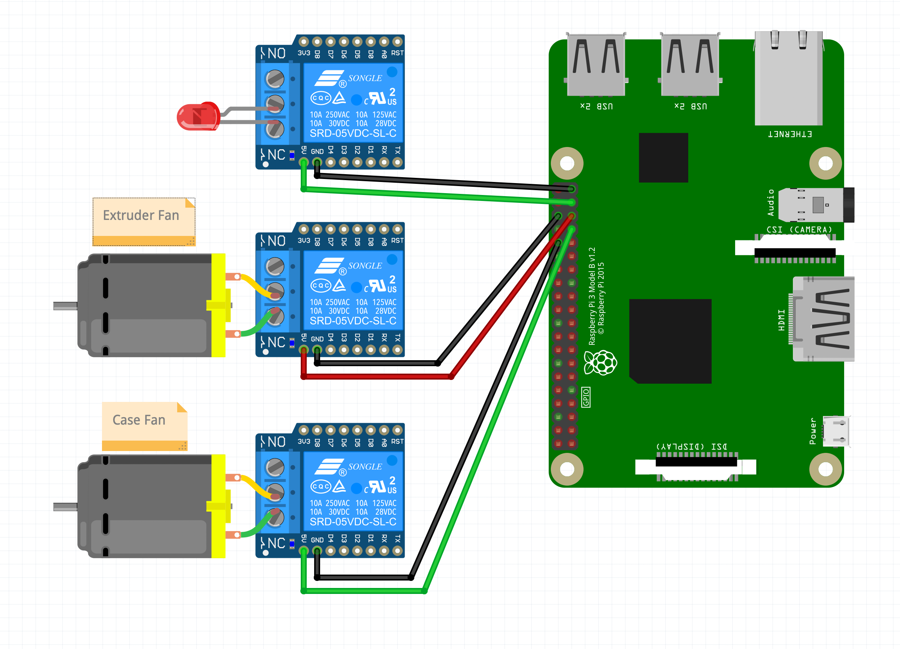
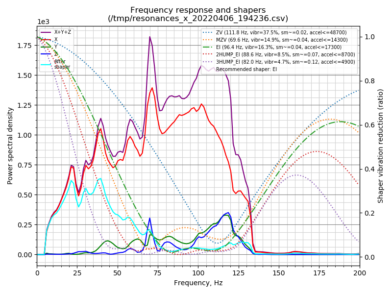
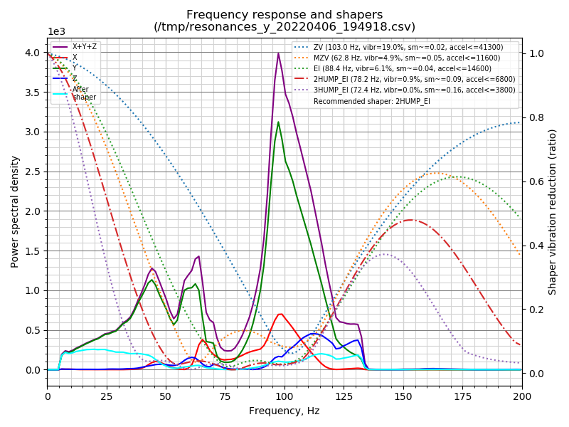
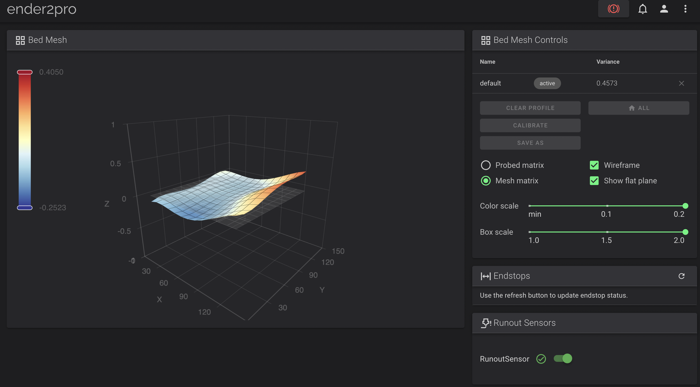

# Klipper Ender 2 Pro

My clipper configuration for the ender 2 pro

[http://ender2pro.local/](http://ender2pro.local/)

## Hardware

- Ender 2 Pro (Purchased December 2021)
- Creality Silent board v4.2.3


## Mods

- [Raspberry Pi Case](https://github.com/spuder/ender2pro-raspberrypi)
- Mosfets on Fans
- [LED Bar](https://github.com/spuder/ender2pro-led-bracket)
- [Run out Sensor](https://www.amazon.com/gp/product/B08QJDP36R/ref=ppx_yo_dt_b_search_asin_title?ie=UTF8&psc=1)
- 12v Regulators on fans
- [BlTouch](https://github.com/spuder/ender2pro-bltouch)



(See [RaspberryPi.fzz](./RaspberryPi.fzz) for schematic)

## Tuning

- https://teachingtechyt.github.io/calibration.html
- https://github.com/AndrewEllis93/Print-Tuning-Guide


### Input Shaper

Input shaper tools are installed with `playbooks/input_shaper.yaml`. The playbook can be called with the makefile shortcut `make input_shaper`

Files are copied from the host back to this repo




Recomended shaper settings are printed out with ansible

```
TASK [Print Calibrate Y] **********************************************************************************************************************
ok: [ender2pro.local] => {
    "msg": [
        "Fitted shaper 'zv' frequency = 103.0 Hz (vibrations = 19.0%, smoothing ~= 0.020)",
        "To avoid too much smoothing with 'zv', suggested max_accel <= 41300 mm/sec^2",
        "Fitted shaper 'mzv' frequency = 62.8 Hz (vibrations = 4.9%, smoothing ~= 0.052)",
        "To avoid too much smoothing with 'mzv', suggested max_accel <= 11600 mm/sec^2",
        "Fitted shaper 'ei' frequency = 88.4 Hz (vibrations = 6.1%, smoothing ~= 0.042)",
        "To avoid too much smoothing with 'ei', suggested max_accel <= 14600 mm/sec^2",
        "Fitted shaper '2hump_ei' frequency = 78.2 Hz (vibrations = 0.9%, smoothing ~= 0.088)",
        "To avoid too much smoothing with '2hump_ei', suggested max_accel <= 6800 mm/sec^2",
        "Fitted shaper '3hump_ei' frequency = 72.4 Hz (vibrations = 0.0%, smoothing ~= 0.156)",
        "To avoid too much smoothing with '3hump_ei', suggested max_accel <= 3800 mm/sec^2",
        "Recommended shaper is 2hump_ei @ 78.2 Hz"
    ]
}
```


### BLTOUCH

A BLTouch is installed.

**Warning**: There are 2 ways to install the BLTouch on a Creality silent board. This assumes using a single 5 pin header instead of separate 2 pin and 3 pin headers. If you don't know the difference, see [timestamp 7:24 in this youtube video by teaching tech](https://youtu.be/eF060dBEnfs?t=444)


##3 Fillament runout sensor

The following part plugs directly into the `Pre-srt Port` on creality board 4.2.2 / 4.2.3


- Part: https://www.amazon.com/gp/product/B08QJDP36R/ref=ppx_yo_dt_b_search_asin_title?ie=UTF8&psc=1

#### klipper runout sensor config

The following will just work on klipper, assuming you already have a 'pause' and 'resume' macro defined. 

As soon as the fillament runs out, it will pause the print. To resume, click the 'resume' macro in the gui

```
[filament_switch_sensor RunoutSensor]
pause_on_runout: True
switch_pin: !PA4
```

If you wish to override the runout sensor with your own macro, you can specify it like so
```
[filament_switch_sensor RunoutSensor]
pause_on_runout: True
switch_pin: !PA4
runout_gcode: PAUSE
insert_gcode: RESUME
```

### Bed Mesh



Run this command to run a bed mesh calibration, then save it for future use


```
BED_MESH_CALIBRATE PROFILE=PEI
SAVE_CONFIG
```

The mesh will then be saved to the printer.cfg. **Be sure to copy it back to this repo or changes will be lost**

Open the printer.cfg in fluidd/mainsail and look for lines that start with:
```
#*# <---------------------- SAVE_CONFIG ---------------------->
#*# DO NOT EDIT THIS BLOCK OR BELOW. The contents are auto-generated.
```

### Setup

The following settings are for a Creality Silent board v4.2.2
```
make menuconfig
# SM32F103
# 28KiB bootloader
# Disable usb for communication
make
# Then copy the .bin file off the raspberry pi and put it on a fresh SD Card.
# The .bin file must be named something unique (and it can't be firmware.bin, or the previous file name)
````

### Resources

- Pinout: https://docs.google.com/spreadsheets/d/1DYhh9fwLnvZzuNvMoBen9Dl68KN-4TWkbO94lJ4iwe4/edit


- https://www.youtube.com/watch?v=MaUU8stsZPo
- https://www.youtube.com/watch?v=ABsdnkP4iwQ
- 4.2.7 pinout https://all3dp.com/2/klipper-ender-3-v2/
- 4.2.7 pinout https://3dprinting.stackexchange.com/questions/16078/steppers-stuck-with-klipper-but-work-with-marlin
- 4.2.7 klipper config https://github.com/Klipper3d/klipper/pull/3335/files
- Install on Ender 3 V2 https://www.youtube.com/watch?v=gfZ9Lbyh8qU
- Klipper Support https://github.com/spuder/klipper/pull/1/files

## Extruder Calibration

- https://3dprintbeginner.com/extruder-calibration-guide/

## Flow Calibration

- https://3dprintbeginner.com/flow-rate-calibration/


## OS setup

To setup the OS

1. Download FluidPI: https://github.com/fluidd-core/FluiddPI
2. Use Ether to create sd card
3. Use ansible/make to configure

## Ansible

klipper config file is located at `/home/pi/klipper_config/printer.cfg`
This repo contains an ansible playbook that will copy the local printer.cfg to the printer and restart the klipper service if it changes. 

To use
1. Modify `inventory` to point at your raspberry pi
2. Run the following ansible commands (Or use the make shortcuts)


```
ansible-playbook --check playbook.yaml
ansible-playbook -i inventory playbook.yaml -c paramiko --ask-pass
```

```
make klipper    # run just the klipper playbook (default)
make moonraker  # run just the moonraker playbook
make webcam     # run just the webcam playbook
make all        # run all playbooks
make            # runs default (in this case klipper)
```
